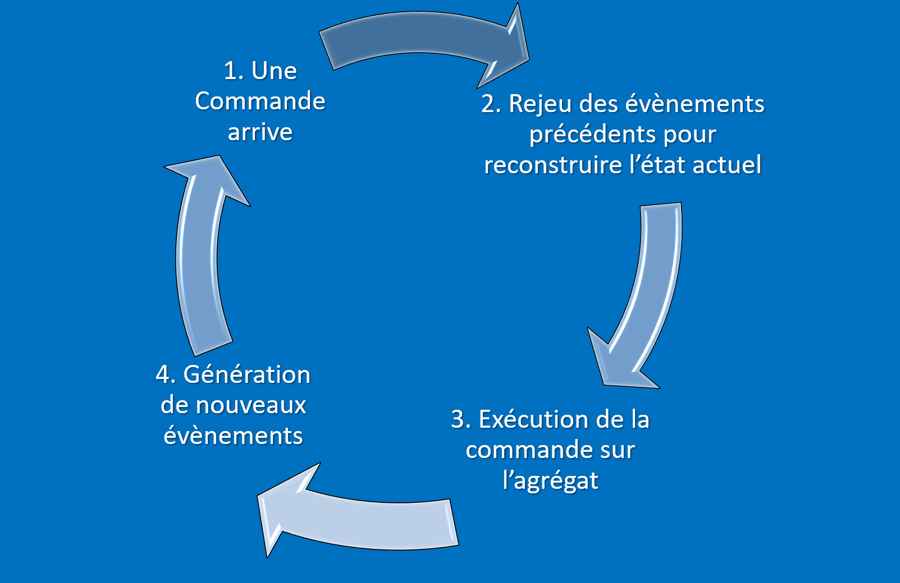
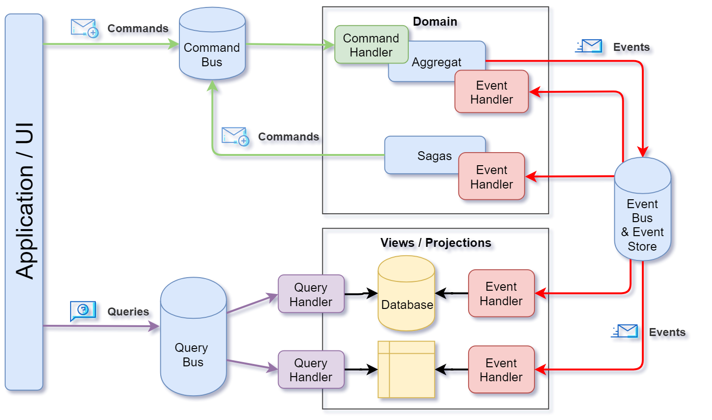
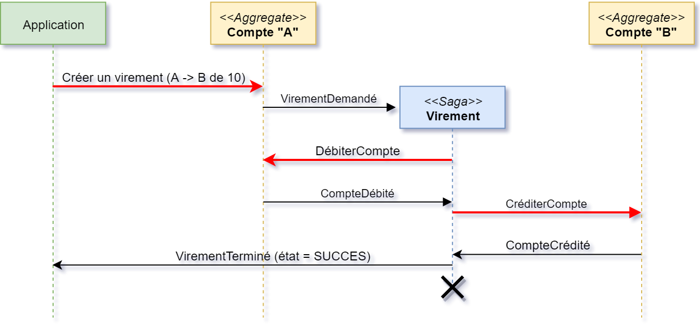
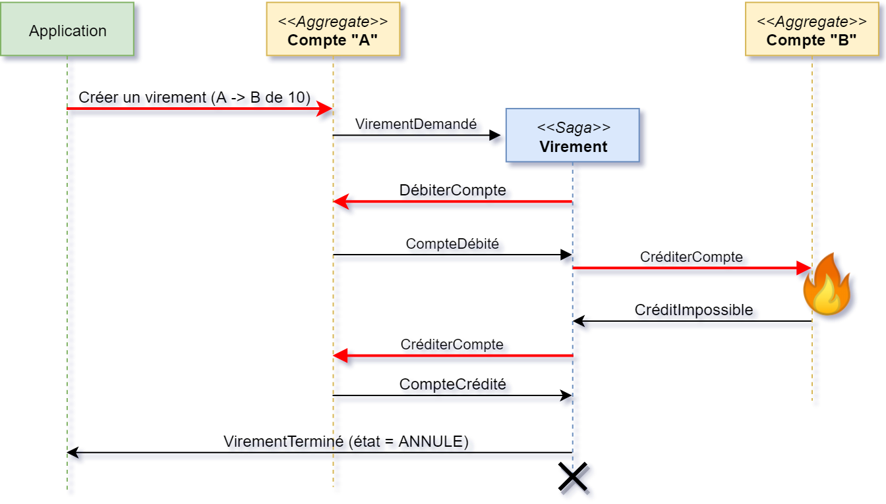

# CQRS 
# Event Sourcing 
avec le framework Axon

---
## Le speaker...

Sylvain Maillard

Lead tech chez E-voyageurs-technologies (ex. oui.sncf)

<small>Mail: [smaillard@oui.sncf](mailto:smaillard@oui.sncf)</small><br/><small>Twitter: [@sylvain_m44](https://twitter.com/sylvain_m44)</small>

---
# Event sourcing ??

C'est quoi ?

note: https://medium.com/tiller-systems/pourquoi-avoir-choisi-dutiliser-l-architecture-cqrs-e04c082f8b5f

---

Stocker les événements plutôt que les états

Note:

Souvent dans les applications on stocke les états: imaginer une table de base de données, par exemple
la base de données de DV dans résarail, ben y a tous les dv en l'état actuel des choses.

Le principe de l'event sourcing est de stocker non pas les états mais tous les changements (évenements) qui ont conduits
à l'état final.

---

Exemple d'état:

````json
{
    "numero": 123456,
    "propriétaire": "Jean Bon",
    "solde": { "valeur":15.0, "devise": "EUR" }
}
```` 

Note:

Exemple bateau. Ici on a un compte en banque. impossible de connaitre les opérations qui ont eu lieu dessus.
pour ce faire, il faut une autre table d'audit par exemple.

---

Version Event sourcing:

````json
    {
        "type_event": "ouverture_compte",
        "timestamp": 1528382470953,
        "numero": 123456,
        "propriétaire": "Jean Bon"        
    }
````
````json
    {
        "type_event": "compte_crédité",
        "timestamp": 1528382517707,
        "numero_compte": 123456,
        "montant": { "valeur":1515.0, "devise": "EUR" }
    }
````
````json
    {
        "type_event": "compte_débité",
        "timestamp": 1528382517900,
        "numero_compte": 123456,
        "montant": { "valeur":1500.0, "devise": "EUR" }
    }
````

Note:

On remarque tout de suite qu'on a beaucoup plus d'informations ici: par exemple on connait
la date de chaque opération, on voit l'évolution.

ça peut être utile.

--- 

# Event Sourcing

Pourquoi on veut faire ça ??

* Auditabilité (en analysant les events)
* Performance (écritures uniquements)
* Reprise de données (en rejouant les events)

---

# Event sourcing: fonctionnement

---

> Un événement représente une modification de l'état d'un *agrégat*.

Les événements s'expriment toujours au passé. 

Ils sont immuables.

Ils sont stockés dans l'ordre dans un Event Store.

Ils sont diffusés via un Event Bus.

note: c'est l'application d'un événement sur un agrégat qui provoque la mutation de l'état
de l'agrégat. par exemple: on ne change le compte que lorsqu'on applique l'état "CompteDébité"  

--- 

## Créer des événements

Avec des commandes

---

> Une commande est une *intention* de modification d'une entité/agrégat.

Une commande peut:

* être rejetée,
* générer un ou plusieurs événements,
* n'avoir aucun effet. 

Note:

La commande génère des effets de bord: communication avec un partenaire extérieur, etc. 

---
Modification de l'état d'un agrégat



---
# Quel rapport avec CQRS ?

Commands Queries Responsability Segregation

note: on voit bien les commandes, c'est quoi les queries ?

---

*Projections*: vues adaptées pour un use case.

- Construites à partir des événements

- Performantes 

- Extensibles 

note: 
donner des exemples
performante: car requétable avec des requêtes simples
On peut en ajouter autant qu'on veut en fonction de l'évolution des uses cases

---

Architecture Event Sourcing / CQRS



---
# Mise en oeuvre

> Vous pouvez (devez) faire sans framework.

[Lu sur un article de blog de Xebia sur l'Event Sourcing](http://blog.xebia.fr/2017/01/16/event-sourcing-comprendre-les-bases-dun-systeme-evenementiel/)

=> ??? en fait... c'est quand même bien pratique un framework. <!-- .element: class="fragment" data-fragment-index="0" -->

note: 
Sur l'article de blog on indique que les concepts derrière l'event sourcing sont tellement simple qu'il n'est pas
nécessaire d'utiliser un framework.

Dans mon expérience ce n'est pas le cas:

- Sur une *application interne oui.sncf*, nous avons utilisé l'ES mais avons pas mal galéré (pas de CQRS,
  on ne rejoue pas les events, gestion manuelle des transactions...),
- Sur *hesperide*, le système d'ES est tellement compliqué qu'il a justifié la refonte complète de l'application.

D'où l'intérêt d'utiliser un framework.

---
# Axon framework

* Abstrait la complexité technique.
* Fournit un framework de test.
* S'interface avec Spring. 

---
# Axon framework

Démo

---
# Transactions 

> A.C.I.D <br/><small>Atomicity, Consistency, Isolation, Durability</small>

vs

> B.A.S.E <br/><small>Basic Availability, Soft state, Eventual consistency</small>

note: comment gérer les transactions avec de l'event sourcing ? notion de ACID et BASE
acid: Atomicity, Consistency, Isolation, Durability
base: Basic Availability, Soft state, Eventual consistency
Grosso modo: on ne peut pas rollbacker une transaction BASE, il faut "compenser les modifications."

---

# Le pattern "SAGA"

* Since 1987
* c'est une conversation entre plusieurs systèmes. 
* lorsque les participants à la conversation sont d'accord, on commit la conversation
* en cas de problème, on prend des actions de compensation
* une transaction est identifiée comme un concept de premier niveau

--- 

## Exemple de Saga



--- 

## Compensation



--- 

# Saga avec Axon

Démo

---

# Conclusion

Event sourcing ?

* Si ce style d'architecture est vraiment pertinent: utiliser axon pour gagner du temps
* Sinon, laisser tomber l'event sourcing: c'est pas si simple.
* Gestion de version: upcasting ?
* RGPD ?

note: 
Parfait on doit utiliser des patterns plus classique: exemple typique: on veut ajouter des utilisateurs avec une contrainte d'unicité sur l'adresse mail: dans
ce cas, il faut utiliser une table classique avec une contrainte d'unicité et une consistence éventuelle classique (acid)
Attention au versionning des events immutables alors que l'application évolue.

---

# Merci !

<small>Feedbacks -> [smaillard@oui.sncf](mailto:smaillard@oui.sncf)</small> 

<small>GitHub de la démo: https://github.com/Sylvain-maillard/cqrs-es-with-axon</small>

<small>GitHub hespéride: https://github.com/voyages-sncf-technologies/hesperides</small>